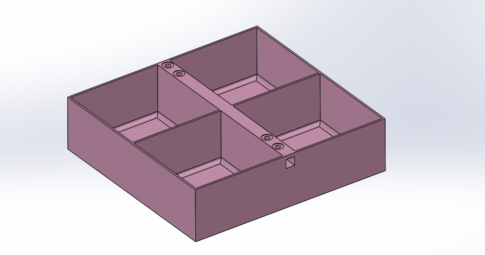

# 🛸 IMechE UAS 2026 Payload & Wing Box Design
- I didn't participate in the UAS Challenge 2026 as I wasn't a student anymore. However since I was following the team and developements closely I came up with this concept

> **Project Type:** Independent Conceptual R&D / Design   
> **CAD Tool:** SolidWorks  

## 📜 2026 Mission Requirements & Constraints
* **Mission:** Agricultural mission requiring aircraft to carry and release liquid payload
* **Payload Mass & Volume:** Carriage of **2.0 Liters ($2,000\text{ cm}^3$)** of clean water
* **Internal Airframe Packaging:** The tank must fit within the fuselage envelope
* **Top-Extraction Capability:** The payload container must be easily inserted and extracted vertically through a top hatch
* **Flight Dynamics:** Operational safety and stability during autonomous navigation and maneuver sequences

## 💡 Design Concept: Multi-Functional 4-Cell Tank

Instead of a single-cavity tank, this concept is inspired by **"ice lolly/popsicle mold"** that serves as both a fluid tank and a wingbox

*(Figure 1: 3D CAD model of the concept in SolidWorks)*

### 1. Sloshing & Free Surface Effect 
In case of take-off and manoeuvring (assuming a fixed-wing design) liquid rapidly surges to one side. This **Free Surface Effect** shifts the aircraft’s Center of Gravity, creating force moments that can overpower flight control surfaces
* Splitting the volume into **four $0.5\text{L}$ isolated compartments** restricts fluid movement and damps slosh momentum

### 2. Wingbox Integration
* There is a channel and mounting bosses in central partition wall 
* These channels allow the primary wing spars / sleeves to pass straight through the middle of the payload bay
* By using the tank structure as an internal fuselage bulkhead, wing bending ($M_b$) and torsional loads are transferred through the assembly 

### 3. Internal Fillets
* Internal bottom corners feature **smooth fillets**.
* This prevents water being trapped in sharp $90^\circ$ corners, and ensures smooth fluid flow during dispensing

##  Predicted Challenges
* **Plumbing & Manifold** | Operating four isolated partitions means four individual drainage/plumbing outlets must connect into a single main dispensing tube

* **Material Weight (PLA)**  Adding internal partition walls increases the overall weight compared to a single thin-walled shell. However since the container doubles as the wing box,and the extra weight would be a small number, this would be more of a trade-off than a challenge depending on the overall aircraft design

> *Note: This design represents a preliminary proof-of-concept study to showcase load-path integration, fluid physics mitigation, and CAD ideation*
